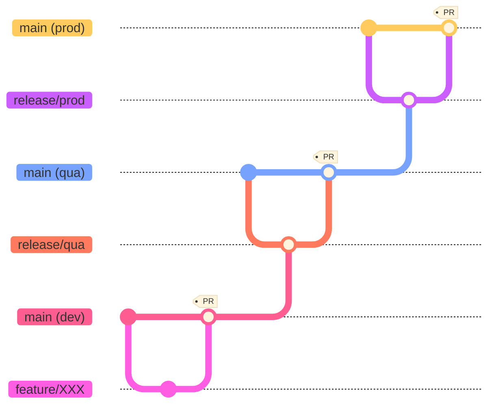

## GIT - Dev to Uat
#### 1.Run only the first time (before running prereq)
```s
git clone https://github.com/ORG/azure-application-uta-westeurope.git
cd azure-application-uta-westeurope
git remote add upstream https://github.com/ORG/azure-application-dev-westeurope.git
git pull upsteam main
git config merge.ours.driver true
git checkout main
git checkout upstream/main -- .gitattributes
git commit -m "Added .gitattributes"
git push
```
#### 2.Run each time
```s
git checkout main
git pull --prune
#### Remove
git branch -D release/qua
git fetch upstream
git diff main upstream/main -- ':!/.github/address_spaces.txt' ':!/.github/workflows/context.json'
git checkout -b release/qua
git merge upstream/main --allow-unrelated-histories --strategy-option theirs 
git push --set-upstream origin release/qua
```
#### 3.Run pipeline on release/qua branch - only plan
#### 4.Create a pull request into main
#### 5.Run pipeline on main branch


## Devops Agent - Build An Image Using Service Principal
```powershell
cd .\Documents\
git clone https://github.com/actions/runner-images.git
cd .\runner-images\
Import-Module .\helpers\GenerateResourcesAndImage.ps1

#Windows
.\helpers\GenerateResourcesAndImage.ps1; GenerateResourcesAndImage `
-SubscriptionId '123abc' `
-ResourceGroupName 'rg-infra-image-prod-01' `
-ImageType 'Windows2022' `
-ManagedImageName ("image-agent-windows-$(Get-Date -Format "yyyy-MM-dd")").ToLower() `
-AzureLocation 'westeurope' `
-AzureClientId "123abc" `
-AzureClientSecret "123abc" `
-ImageGenerationRepositoryRoot $pwd `
-SecondsToWaitForServicePrincipalSetup 120 `
-AzureTenantId "123abc" `
-OnError "ask" `
-Tags @{}

#Linux 2024
.\helpers\GenerateResourcesAndImage.ps1; GenerateResourcesAndImage `
-SubscriptionId '123abc' `
-ResourceGroupName 'rg-infra-image-prod-01' `
-ImageType 'Ubuntu2404' `
-ManagedImageName ("image-agent-linux24-$(Get-Date -Format "yyyy-MM-dd")").ToLower() `
-AzureLocation 'westeurope' `
-AzureClientId "123abc" `
-AzureClientSecret "123abc" `
-ImageGenerationRepositoryRoot $pwd `
-SecondsToWaitForServicePrincipalSetup 120 `
-AzureTenantId "123abc" `
-OnError "ask" `
-Tags @{}
```
