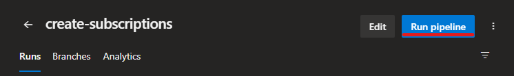
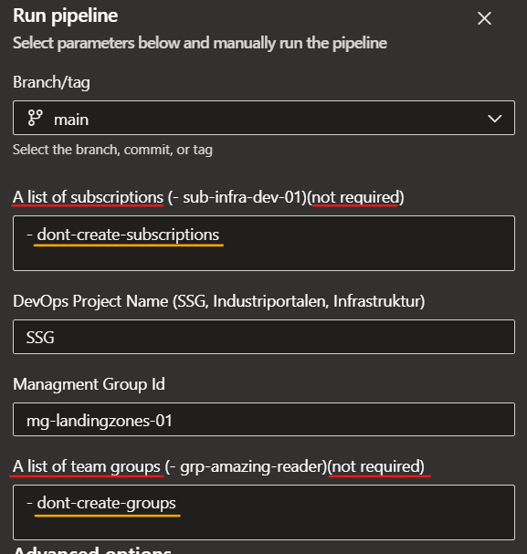

# Create subscriptions
- To create new subscriptions and entra id groups run pipeline `create-subscriptions-and-team-groups`, [LINK HERE](https://dev.azure.com/abcse/Infrastruktur/_build?definitionId=845).
---------
- Put the name of new subscriptions ( `-` in front of the name) and DevOps project
- The script will create new subscriptions, add them to the management group, create service principals/connections and assign Owner. 
- You can skip creation of subscriptions by leaving `- dont-create-subscriptions`
--------
- Put the name of new groups ( `-` in front of the name)
- You can skip creation of groups by leaving `- dont-create-groups`




# Permissions

Service principle needs following permissions:

- Owner at tenant scope
- Application Admin
- Groups Administrator
- Billing account contributor (in Billing subscriptions) [LINK HERE](https://learn.microsoft.com/en-us/azure/cost-management-billing/manage/programmatically-create-subscription).
- Project Collection Administrators in DevOps
- Endpoint Administrator in used DevOps Projects

# Get billing information
```powershell
$billingAccounts = (Get-AzBillingAccount).Name #147db654-xxxx
$billingProfile = (Get-AzBillingProfile -BillingAccountName $billingAccounts).Name
$invoiceSections = (Get-AzInvoiceSection -BillingAccountName $billingAccounts -BillingProfileName $billingProfile)[0].Name
$billingScope = "/providers/Microsoft.Billing/billingAccounts/$billingAccounts/billingProfiles/$billingProfile/invoiceSections/$invoiceSections"
$billingScope
```
# Recreate subscription
If you need to recreate a subscription, subscription alias must be removed first.

`az account alias delete --name`


