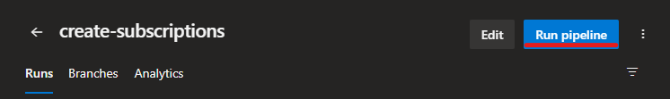
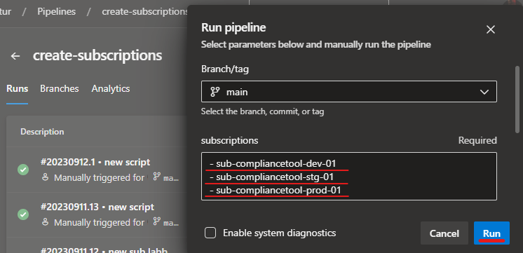

# Create subscriptions
- To create new subscriptions run pipeline `create subscriptions`.
- Put the name of new subscriptions ( `-` in front of the name)
- The script will create new subscriptions, add them to the management group, create service principals/connections and assign Owner. 
- The code must be approved by IT Manager





# Permissions

Service principle needs following permissions:

- Owner at tenant scope
- Application Admin
- Billing account contributor (in Billing subscriptions) [LINK HERE](https://learn.microsoft.com/en-us/azure/cost-management-billing/manage/programmatically-create-subscription).
- Project Collection Administrator in DevOps

# Get billing information
```powershell
$billingAccounts = (Get-AzBillingAccount).Name
$billingProfile = (Get-AzBillingProfile -BillingAccountName $billingAccounts).Name
$invoiceSections = (Get-AzInvoiceSection -BillingAccountName $billingAccounts -BillingProfileName $billingProfile)[0].Name
$billingScope = "/providers/Microsoft.Billing/billingAccounts/$billingAccounts/billingProfiles/$billingProfile/invoiceSections/$invoiceSections"
$billingScope
```


