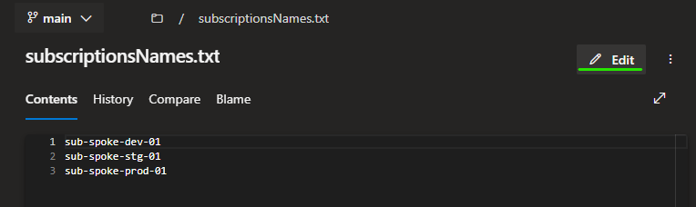
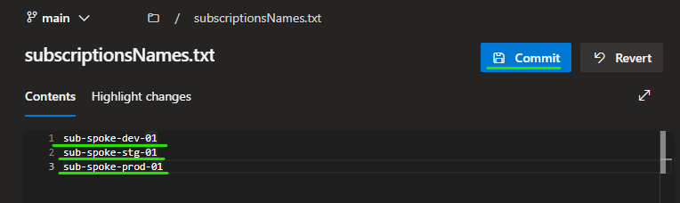

# Create subscriptions
- To create new subscriptions edit the file `subscriptionsNames.txt` and put the names of the new subscriptions.

- The script will create new subscriptions, add them to the management group, create service principals and assign Owner. 

- Can be done in the Devops portal / no pull request. 

- The code must be approved by IT Manager

# Permissions

Service principle needs following permissions:

- Owner at tenant scope
- Application Admin
- Billing account contributor (in Billing subscriptions)

